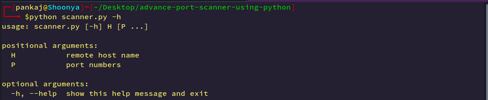
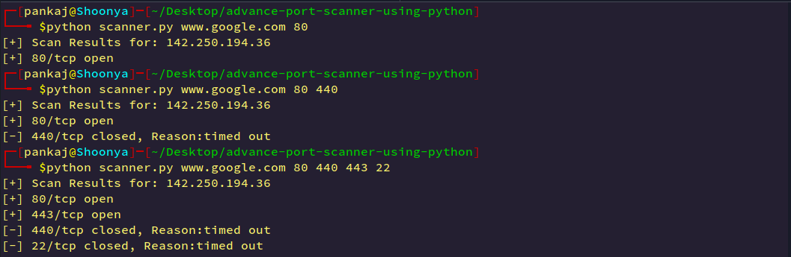

# Advance-Port-Scanner-CLI
## how port scanner work?
- This port scanner does a port/ports scan for a remote host.
- The list of ports and a remote host are entered as command line args.
- We create a separate thread to check port connection. Hence it is faster and more efficient.

### Clone the Repository

```
git clone https://github.com/Pankaj-SinghR/advance-port-scanner-using-python.git
```
### Change directory
```
cd advance-port-scanner-using-python
```

### let's scan 
### Help menu
```
python scanner.py -h
```


### Scanning www.google.com
```
python scanner.py www.google.com 80 440 443 22
```

